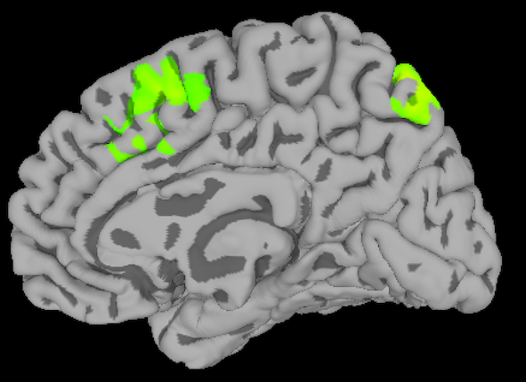

doc01
=====

https://afni.nimh.nih.gov/

https://afni.nimh.nih.gov/pub/dist/doc/htmldoc/

https://afni.nimh.nih.gov/afni/doc/program_help/index.html

https://www.opensourceimaging.org/project/afni/

https://en.wikipedia.org/wiki/Analysis_of_Functional_NeuroImages

A package of computer programs for analysis and visualization of three-dimensional human brain functional magnetic 
resonance imaging (FMRI) results is described. The software can color overlay neural activation maps onto higher 
resolution anatomical scans. Slices in each cardinal plane can be viewed simultaneously. Manual placement of markers 
on anatomical landmarks allows transformation of anatomical and functional scans into stereotaxic (Talairach–Tournoux) 
coordinates. The techniques for automatically generating transformed functional data sets from manually labeled 
anatomical data sets are described. Facilities are provided for several types of statistical analyses of multiple 3D 
functional data sets. The programs are written in ANSI C and Motif 1.2 to run on Unix workstations.

https://andysbrainbook.readthedocs.io/en/latest/AFNI/AFNI_Short_Course/AFNI_fMRI_Intro.html

.. _AFNI_fMRI_Intro57:

==============
Introduction to AFNI
==============

------------

This course will show you how to analyze an fMRI dataset from start to finish. We will begin by **downloading a sample 
dataset** and inspecting the anatomical and functional images for each subject. We will then preprocess the data, 
which 
removes noise and enhances the signal in the images. Once the images have been preprocessed, we will create a model 
representing what we think the BOLD signal, a measure of neural activity, should look like in our images. During model 
fitting we compare this model with the signal in different areas of the image. This model fit is a measure of the 
strength of the signal under different conditions - for example, we can take the difference of the signal between 
conditions A and B of the experiment to see which condition leads to a larger BOLD response.

Once a model has been created for each subject and the BOLD response has been estimated for each condition, we can do 
any kind of group analysis we like: Paired t-tests, between-group t-tests, interactions, and so on. The goal of this 
course is to calculate a simple within-subjects contrast between two conditions, and test whether it is significant 
across subjects. You will also learn how to create figures showing whole-brain analyses, similar to what you see 
published in the neuroimaging journals, and how to do a region of interest (ROI) analysis.

   A figure showing group-level results from the data used in this course, represented as a z-statistic map. Brighter colors indicate larger z-scores. You will begin by preprocessing the raw data and end with creating a statistical map  
like this one.

This course is designed to build your confidence in working with fMRI data, increase your fluency with the basic terms 
of fMRI analysis, and help you make educated choices during each step. Some chapters have exercises to help you 
practice what you’ve learned and to prepare you for the next chapter. Once you have mastered the fundamentals of this 
course, you will be able to apply them to other datasets of your choosing.

Downloading and Installing AFNI
*******************************

Depending on your computer’s operating system, you have several different options for downloading and installing the 
AFNI package. The AFNI website has instructions on how to install the software on Windows, Macintosh, and different 
versions of Linux; a tutorial video on how to install AFNI on a Macintosh operating system can be found here.

For Macintosh users, an installation app has been created that will streamline the process. Once you have downloaded 
it here, simply unpack the app and follow the instructions; I recommend keeping the default boxes checked.

If you do not have any of the required packages, such as R or Homebrew, the entire installation can take 1-2 hours. 
When it has completed, open a Terminal, type afni, and then press return. You should see the graphical user interface 
open. Close it, and from the same terminal type uber_subject.py and press return. You should see this window, which 
indicates that any Python-based programs should run without errors.

../../_images/Intro_AFNI_GUI.png
When you have successfully installed AFNI and typed afni from the command line, you should see something like this.

Note

This course will not be covering MRI physics in depth. For a review of that topic, I recommend chapters 1-5 of the 
book Functional Magnetic Resonance Imaging, by Huettel, Song, & McCarthy (3rd Edition). Also see Allen Elster’s 
excellent MRI Questions website for useful illustrations of MRI concepts.

Video
For a brief video introduction to AFNI and a walkthrough of how to download it, click here.

